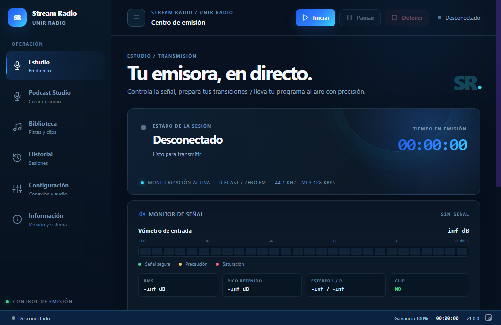
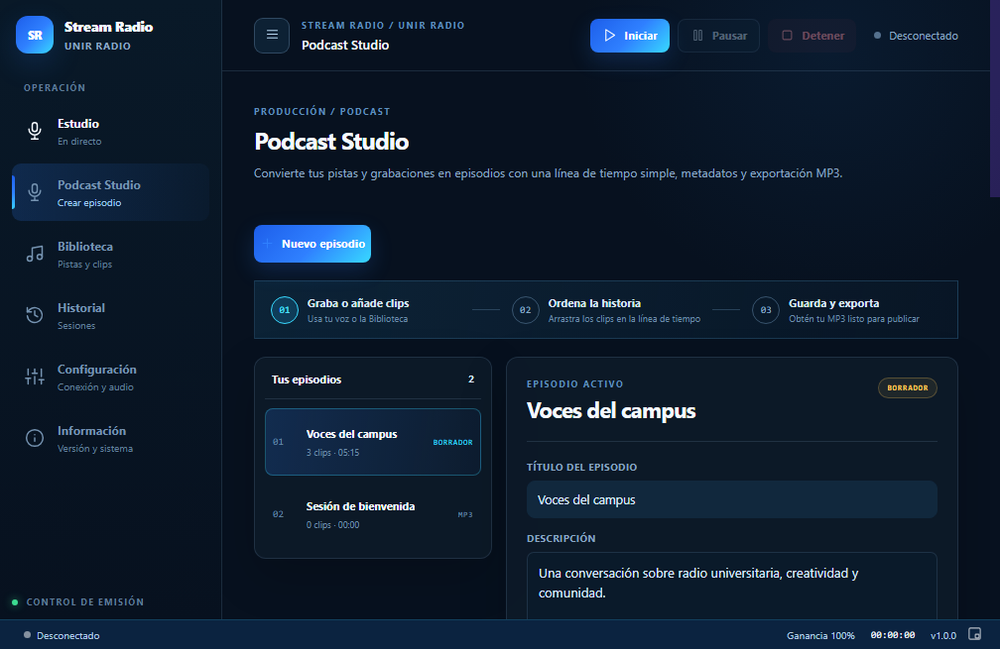
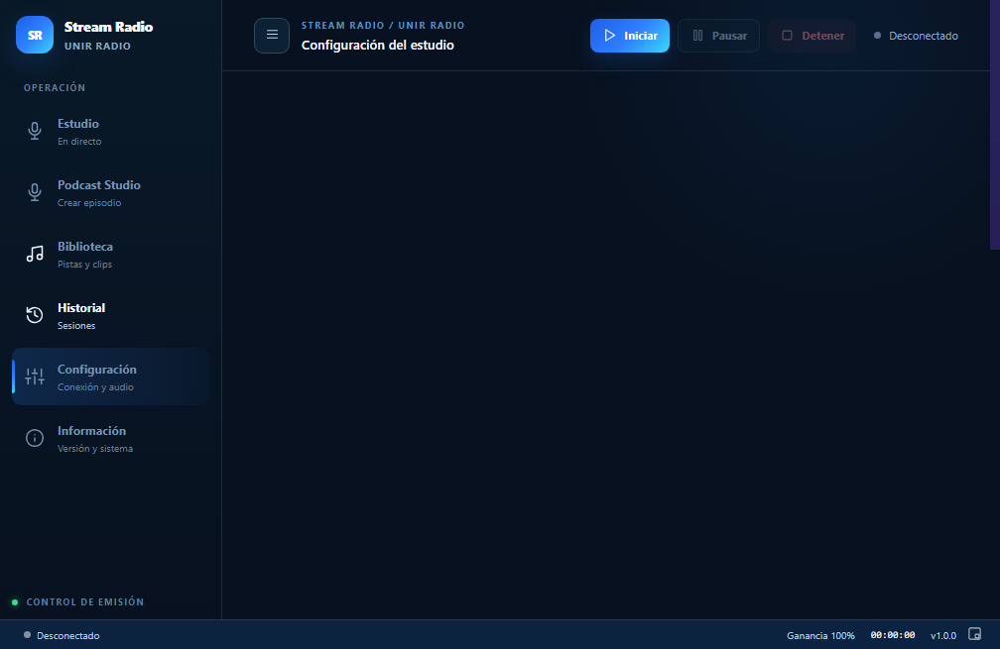
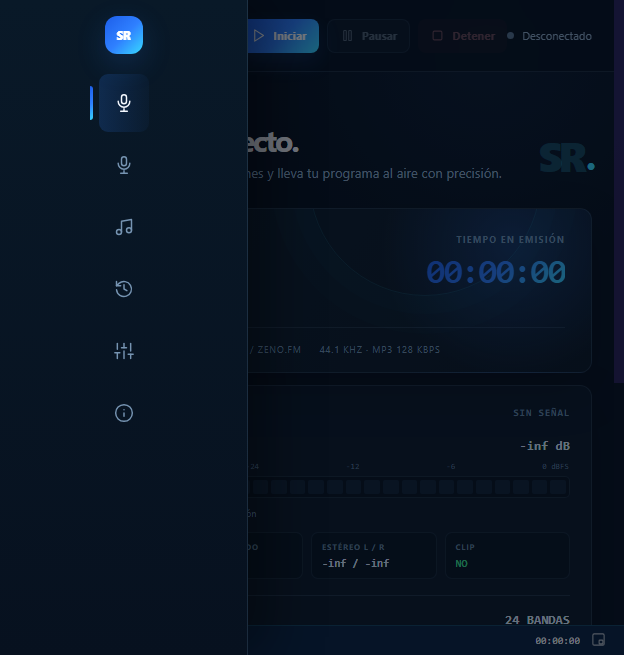

# Stream Radio

**Stream Radio** es una aplicación de escritorio para Windows, construida con Electron, que permite transmitir radio en vivo desde un micrófono o consola hacia Zeno.fm y servidores Centova Cast. La aplicación combina captura de audio nativa, FFmpeg, biblioteca de pistas, transiciones, grabación local opcional, monitorización profesional y actualización automática desde GitHub.

> **Versión actual: v1.2.0**

[Repositorio principal](https://github.com/jhersara/Stream-Unirradio) · [Releases](https://github.com/jhersara/Stream-Unirradio/releases)

## Capturas de la aplicación

La interfaz utiliza una identidad editorial oscura con acentos azules, controles de emisión visibles y navegación adaptable a ventanas pequeñas.

### Centro de emisión



El Centro de emisión muestra el estado de la sesión, el contador, el vúmetro segmentado, el monitor de señal, el ecualizador y los controles principales de Iniciar, Pausar/Reanudar y Detener.

### Biblioteca de pistas



La Biblioteca conserva las pistas importadas dentro del almacenamiento de la aplicación y permite reproducir una preescucha antes de utilizar una pista como intro, outro o clip de Podcast Studio.

### Configuración



La configuración utiliza un selector de proveedor y campos dinámicos. Los datos sensibles se pueden mostrar u ocultar, copiar y validar antes de comenzar una transmisión.

### Navegación responsive



En ventanas pequeñas, la navegación lateral se transforma en un menú desplegable sobre el contenido y la barra superior conserva los controles esenciales de emisión.

## Funciones principales

| Área | Funcionalidad |
|---|---|
| Emisión en vivo | Conexión a Zeno.fm y Centova Cast mediante Icecast o SHOUTcast. |
| Motor de audio | Captura nativa con `naudiodon` y procesamiento con FFmpeg. |
| Transiciones | Intro antes de abrir el micrófono y outro diferido al detener la sesión. |
| Pausa | Pausa y reanudación manteniendo la conexión activa y enviando silencio controlado. |
| Grabación local | Confirmación opcional al iniciar; al detener permite definir nombre y carpeta mediante un selector de guardado, con Documentos como destino predeterminado. |
| Biblioteca | Importación múltiple, almacenamiento persistente, eliminación y preescucha. |
| Podcast Studio | Episodios, grabación de voz, clips, línea de tiempo, exportación MP3, ducking y medición opcional. |
| Monitorización | Vúmetro, pico retenido, RMS, estéreo L/R, clip y ecualizador de 24 bandas. |
| Actualizaciones | Detección desde GitHub, progreso 0–100%, estado persistente y reinicio para instalar. |
| Responsive | Barra superior y menú desplegable para distintos tamaños de ventana. |

## Proveedores de streaming

Selecciona el proveedor en **Configuración** según los datos que aparecen en el panel de conexiones de fuente de tu plataforma.

| Proveedor | Protocolo | Campos principales | Transporte interno |
|---|---|---|---|
| Zeno.fm · Icecast | Icecast | Host, puerto, mountpoint, usuario y contraseña | FFmpeg envía directamente al endpoint Icecast. |
| Centova Cast · Icecast | Icecast | Host, puerto, mountpoint, usuario y contraseña | Comparte el perfil Icecast compatible con Zeno. |
| Centova Cast · SHOUTcast | SHOUTcast ICY | Host, puerto, contraseña y Stream ID cuando aplica | FFmpeg codifica a `stdout`; el puente TCP/ICY realiza el handshake y entrega el MP3. |

### Diferencia operativa

Icecast y SHOUTcast cumplen una función semejante, pero no utilizan el mismo protocolo de fuente. En Icecast, FFmpeg puede conectarse directamente usando una URL con mountpoint. En SHOUTcast, la aplicación separa la codificación MP3 del transporte y utiliza `src/main/shoutcast-source.js` para autenticar y enviar la fuente mediante el protocolo ICY.

## Flujo de transmisión

El flujo de emisión está diseñado para que la intro ocurra antes de liberar el micrófono al operador.

```text
Validar configuración
        ↓
Conectar al proveedor seleccionado
        ↓
Iniciar encoder FFmpeg
        ↓
Reproducir intro completa
        ↓
Abrir captura de micrófono · EN VIVO
        ↓
Pausar/Reanudar sin cerrar conexión, si es necesario
        ↓
Detener captura de micrófono
        ↓
Reproducir outro
        ↓
Cerrar la conexión cuando faltan 2 segundos
        ↓
Guardar historial y finalizar la grabación local opcional
```

Zeno.fm y algunos servicios de AutoDJ pueden introducir una latencia de varios segundos al detectar el cambio entre programación automática y fuente en vivo. Esa latencia pertenece al servicio receptor y no significa que el encoder local haya comenzado tarde.

## Grabación local durante una transmisión

Al pulsar **Iniciar**, Stream Radio pregunta si también se desea guardar una copia local. Si se responde afirmativamente, la aplicación crea un segundo proceso FFmpeg que recibe una copia del audio de intro, voz y outro.

La grabación local se inicia después de confirmar que el encoder principal está preparado. Su presión de escritura se controla de forma independiente para que una grabación lenta no detenga la emisión en vivo. Si el grabador local falla, la transmisión continúa y el incidente queda registrado en la actividad.

Los archivos se guardan en:

```text
Documentos/Stream Radio - Grabaciones/
```

## Podcast Studio

Podcast Studio está organizado como un flujo guiado:

1. **Graba o añade clips.** Usa la captura directa de voz o selecciona recursos de la Biblioteca.
2. **Ordena la historia.** Arrastra los clips y utiliza la preescucha de cada segmento.
3. **Guarda y exporta.** Conserva el borrador y genera un MP3 cuando el episodio esté listo.

Las funciones profesionales, como ducking automático, RMS, LUFS, fades, recorte IN/OUT, volumen por segmento y automatización por envolvente, permanecen disponibles dentro de paneles avanzados plegables para no sobrecargar la primera vista.

## Auto-updater en producción

La aplicación utiliza `electron-updater` y los Releases del repositorio de GitHub. Cuando detecta una versión nueva, la vista **Información** muestra el ciclo completo:

| Estado | Visualización |
|---|---|
| Comprobando | Estado de consulta al repositorio. |
| Disponible | Nueva versión encontrada y descarga preparada. |
| Descargando | Porcentaje, barra, MB transferidos y velocidad. |
| Descargada | Barra conservada al 100%, estado “Lista para instalar” y botón de reinicio. |
| Error | Mensaje de diagnóstico y posibilidad de volver a comprobar. |

El último estado se conserva en el proceso principal para que no se pierda si la descarga termina antes de que la interfaz termine de cargar.

## Arquitectura

```text
Renderer (HTML/CSS/JS)
        │
        ▼
Preload · contextBridge seguro
        │
        ▼
IPC · handlers de la aplicación
        │
        ├── ffmpeg-stream.js · transmisión, pausa, intro, outro y grabación
        ├── radio-providers.js · perfiles Zeno/Icecast/Centova/SHOUTcast
        ├── shoutcast-source.js · puente TCP/ICY para SHOUTcast
        ├── podcast-recorder.js · grabación directa de voz
        ├── podcast-exporter.js · mezcla y exportación MP3
        ├── library-manager.js · biblioteca persistente
        ├── settings-store.js · configuración y contraseña cifrada
        └── auto-updater.js · actualizaciones desde GitHub
```

La interfaz utiliza `contextIsolation` y expone únicamente APIs controladas a través de `src/preload/preload.js`. La contraseña de transmisión se cifra con `safeStorage` en Windows antes de guardarse en la configuración local.

## Estructura del proyecto

```text
Stream-Unirradio/
├── package.json
├── README.md
├── CHANGELOG.md
├── resources/
│   ├── icon.ico
│   └── ffmpeg/              # Recursos locales para construir el instalador
├── docs/
│   └── screenshots/         # Capturas públicas de documentación
└── src/
    ├── main/
    │   ├── main.js
    │   ├── ffmpeg-stream.js
    │   ├── radio-providers.js
    │   ├── shoutcast-source.js
    │   ├── podcast-recorder.js
    │   ├── podcast-exporter.js
    │   ├── library-manager.js
    │   ├── settings-store.js
    │   └── auto-updater.js
    ├── preload/
    │   └── preload.js
    └── renderer/
        ├── index.html
        ├── renderer.js
        ├── styles.css
        ├── icons.js
        └── sound-fx.js
```

## Instalación para desarrollo

El proyecto requiere Windows, Node.js, herramientas de compilación compatibles con módulos nativos y los recursos locales de FFmpeg en `resources/ffmpeg/`. `naudiodon` necesita recompilarse para el ABI de Electron.

```bash
git clone https://github.com/jhersara/Stream-Unirradio.git
cd Stream-Unirradio
npm install
npm start
```

Para ejecutar el modo de prueba con GPU desactivada:

```bash
npm start -- --disable-gpu
```

## Construcción del instalador

El instalador NSIS se genera dentro de `dist/`. El binario de FFmpeg se incluye como recurso del instalador, pero se mantiene fuera del repositorio mediante `.gitignore` por su tamaño.

```bash
npm run dist
```

Para construir y publicar mediante la configuración de GitHub de `electron-builder`:

```bash
npm run dist:publish
```

El release de Windows contiene normalmente el instalador `.exe`, `latest.yml` y el archivo `.blockmap` utilizado por las actualizaciones diferenciales.

## Pruebas y validación

Los módulos JavaScript se validan con `node --check`. El proyecto también incluye pruebas para los perfiles de proveedores, el puente SHOUTcast y la salida MP3 de FFmpeg.

```bash
node --check src/main/ffmpeg-stream.js
node --check src/main/auto-updater.js
node test-radio-providers.js
node test-shoutcast-source.js
node test-ffmpeg-shoutcast-profile.js
```

Las pruebas de conexión real dependen de las credenciales del servidor de radio. No se deben escribir contraseñas reales en el repositorio, en capturas ni en archivos de configuración compartidos.

## Solución de problemas frecuentes

| Síntoma | Revisión recomendada |
|---|---|
| No conecta con Icecast | Verifica host, puerto, usuario, contraseña y mountpoint copiados desde el panel del proveedor. |
| SHOUTcast rechaza la fuente | Selecciona el proveedor SHOUTcast y revisa el Stream ID cuando el panel lo requiera. |
| La barra de actualización no aparece | Abre Información; el estado descargando debe mostrar porcentaje y la actualización terminada debe conservar la barra al 100%. |
| La grabación local falla | Revisa la carpeta Documentos o la carpeta elegida en el selector de guardado y el log; un fallo local no debería detener la transmisión. |
| Aviso de GPU de Chromium | Es un aviso gráfico de Electron; no implica por sí mismo un fallo de audio. |
| Aviso final de libmp3lame | El mensaje sobre la cola de muestras puede aparecer durante el cierre del encoder y no necesariamente indica una transmisión fallida. |

## Licencia y publicación

El proyecto es privado para uso de UNIR Radio y se distribuye mediante los Releases configurados en GitHub. Consulta las notas completas de la versión en [CHANGELOG.md](CHANGELOG.md) y descarga el instalador desde [Stream Radio v1.2.0](https://github.com/jhersara/Stream-Unirradio/releases/tag/v1.2.0).
